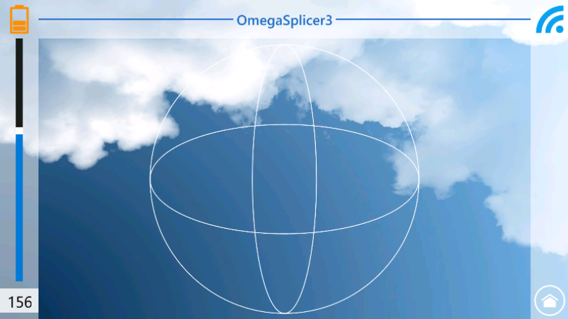

<b><a href="#overview">Overview</a></b>
|
<b><a href="#screenshots">Screenshots</a></b>
|
<b><a href="#credits">Credits</a></b>
|
<b><a href="#license">License</a></b>


.aspx)

# Omega-Splicer for Windows Phone

## Overview

Ceci est le dépot de l'application windows phone Omega-Splicer. C'est un projet Epitech de 5ème année, l'EIP (Epitech Innovative Project).

## Screenshots

## Credits

Dimitri CISNEROS : https://fr.linkedin.com/in/billybichon

## License

Licensed under the MIT license.
